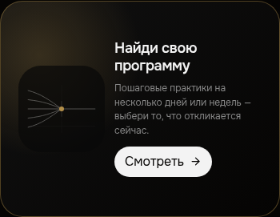

# MXL-LIBRARY-V2-BANNER-TYPO-009 — отчёт

## Результат

Проверка выполнена на production-сборке `npm run build` с тем же V2-флагом, который включает Library V2 (`VITE_LIBRARY_V2=true`), и на preview с viewport **390×844 px**. Расхождение воспроизведено: предыдущие значения `23px / 400 / 1.06 / -0.04em` не соответствовали реальному эталонному элементу. Эталонный заголовок «Разбери день на части» является `h2.mx-type-section` и фактически получает `18px / 600 / 1.2 / -0.02em`. Наш `h3` после фикса получает те же значения.

## Скриншоты

Эталонный баннер «Журнал» на «Шагах» (`h2`, 390 px):


Наш баннер «Программы» на «Библиотеке» до исправления (`h3`, 390 px):


Наш баннер после исправления (`h3`, 390 px):



На снимке до фикса заголовок заметно крупнее и легче по начертанию. После фикса его высота строки стала ровно такой же, как у эталона: `43.1875px` для двух строк (`21.6px × 2`). Гарнитура и все четыре проверяемых типографических значения совпадают; оставшаяся разница ширины/переноса обусловлена разным текстом и колонками двух разных баннеров, а не CSS-типографикой.

## CSS Styles / каскад

### Эталон: `Разбери день на части`

Разметка: `src/components/PracticeCatalogV2.jsx:24` — `<h2 className="mx-type-section">`.

Применяемые правила в Styles:

| Статус                                | Правило                           | Файл и строки                              | Значения                                                                                                                                                                                   |
| ------------------------------------- | --------------------------------- | ------------------------------------------ | ------------------------------------------------------------------------------------------------------------------------------------------------------------------------------------------ |
| применяется                           | `.mx-type-section`                | `src/index.css:730-735`                    | `font-size: var(--mx-type-section-size)` (`18px`), `line-height: 1.2`, `font-weight: 600`, `letter-spacing: -0.02em`                                                                       |
| применяется                           | `h2` browser default              | UA stylesheet                              | margin переопределён локальным `.mx-layered-catalog__journal-hero-copy h2 { margin: 0; }` в `src/components/ui-lab/LayeredPracticeCatalogExperiment.css` (правило в production stylesheet) |
| не задаёт font-family                 | `:root`                           | `src/index.css:533-541`                    | root fallback — `Manrope, system-ui, ...`; в данном app-контейнере он перекрыт наследуемым Tailwind utility `font-body`                                                                    |
| задаёт font-family через наследование | `.font-body`                      | `tailwind.config.js:28-34`                 | `font-family: Onest, sans-serif`                                                                                                                                                           |
| задаёт источник наследования          | основной app wrapper `.font-body` | `src/App.jsx:910-927`, особенно строка 920 | оба баннера находятся внутри этого контейнера                                                                                                                                              |

### Наш: `Найди свою программу` до фикса

Разметка: `src/screens/Library.jsx:68` и `src/screens/Library.jsx` внутри `LibraryV2FeaturedBanner` — `<h3>` без дополнительного класса.

Полный список релевантных правил, включая правило, которое оказалось причиной расхождения:

| Статус                                | Правило                                                 | Файл и строки                                   | Значения                                                                                                                                        |
| ------------------------------------- | ------------------------------------------------------- | ----------------------------------------------- | ----------------------------------------------------------------------------------------------------------------------------------------------- |
| причина, применялось                  | `.mx-library-v2__featured-copy h3`                      | `src/screens/Library.css:423-430` до фикса      | `font-size: 23px; font-weight: 400; line-height: 1.06; letter-spacing: -0.04em`                                                                 |
| применяется                           | `.mx-library-v2__featured-copy p`                       | `src/screens/Library.css:432-439`               | описание: `12px / 400 / 1.45`; не являлось причиной расхождения заголовка                                                                       |
| применяется                           | `.mx-library-v2__pill`                                  | `src/screens/Library.css:461-474`               | кнопка: `13px / 700`; не являлась причиной расхождения заголовка                                                                                |
| не найдено                            | поздний override для `.mx-library-v2__featured-copy h3` | весь `src/screens/Library.css` после строки 423 | дополнительных правил для этого селектора ниже нет; расхождение было не из-за перебитого позднего селектора, а из-за неверных исходных значений |
| задаёт font-family через наследование | `.font-body`                                            | `tailwind.config.js:28-34`                      | `font-family: Onest, sans-serif`                                                                                                                |
| задаёт источник наследования          | основной app wrapper `.font-body`                       | `src/App.jsx:910-927`, строка 920               | `h3` получает тот же `Onest`, что и эталонный `h2`                                                                                              |
| не перебивает font-family             | `.font-display`                                         | `src/index.css:615-619`                         | к обоим целевым h2/h3 не применяется; задаёт только `font-weight: 700` и `letter-spacing: -0.02em` для элементов с этим классом                 |

Важная проверка общего сброса: в `src/index.css` нет отдельного `h1, h2, h3 { font-family: ... }`, который перебивал бы эти элементы. `src/index.css:533-541` задаёт root fallback, а фактическая `Onest` приходит от `.font-body` на wrapper и наследуется обоими заголовками. Поэтому **font-family не была причиной**.

## Исправление

Изменён только `src/screens/Library.css:423-430`:

```css
.mx-library-v2__featured-copy h3 {
  font-size: 18px;
  font-weight: 600;
  line-height: 1.2;
  letter-spacing: -0.02em;
}
```

Сборка после изменения проходит успешно. Проверка браузером после фикса:

| Элемент                     | font-family         | font-size | font-weight | line-height | letter-spacing |
| --------------------------- | ------------------- | --------: | ----------: | ----------: | -------------: |
| Эталон `h2.mx-type-section` | `Onest, sans-serif` |    `18px` |       `600` |    `21.6px` |      `-0.36px` |
| Наш `h3` после фикса        | `Onest, sans-serif` |    `18px` |       `600` |    `21.6px` |      `-0.36px` |

Снимки сделаны Playwright в production preview на `390×844`, с URL-параметрами `demo=1`, `tab=practices` / `tab=library`, `library_v2=1`.

## Файлы

- Изменение: `src/screens/Library.css`
- Скриншоты: `01-reference-journal-390.png`, `02-our-program-390-before.png`, `02-our-program-390-after.png`
- Автоматизированный capture/audit: `tools/capture_library_typography.mjs`
- JSON-аудит computed-значений: `css-cascade-before.json`
