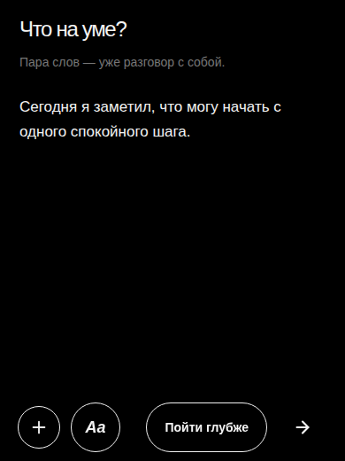
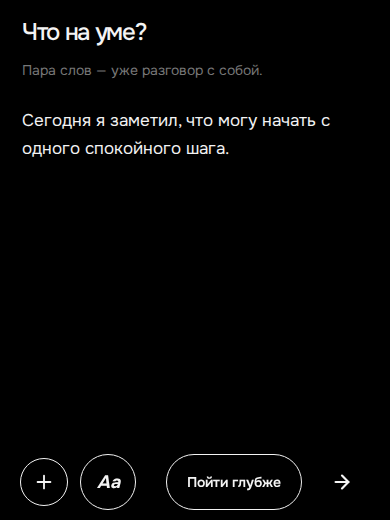
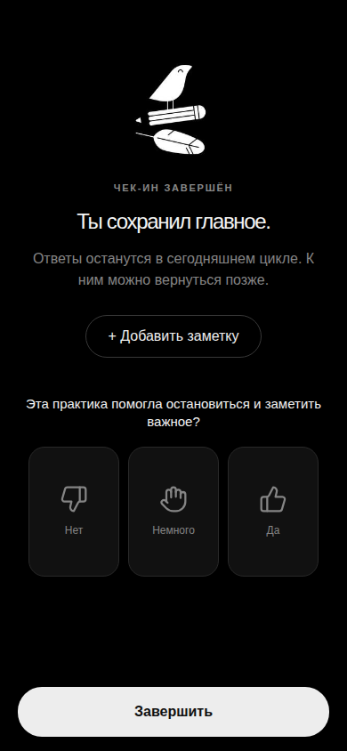
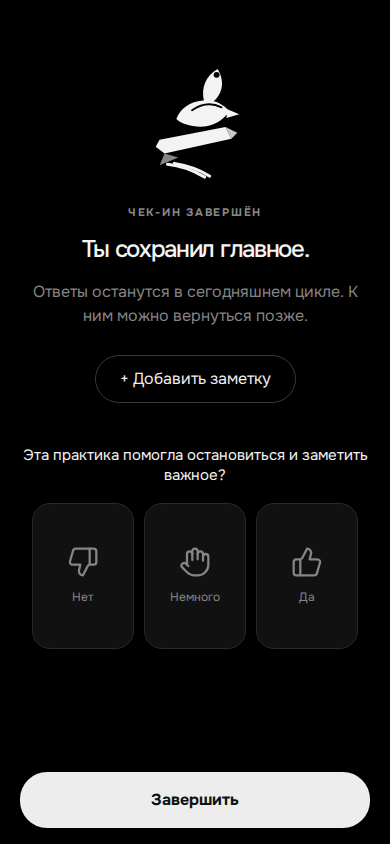
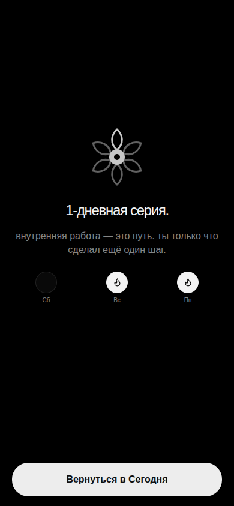

# Morning Check-In visual fixes

## Evidence

| Issue                                                         | Before                                                                            | After                                                                                    |
| ------------------------------------------------------------- | --------------------------------------------------------------------------------- | ---------------------------------------------------------------------------------------- |
| Text editor shifts under the keyboard and clips the question  |  |          |
| Completion artwork is a raster PNG with visible edge mismatch |            |          |
| Streak flower does not match the reference treatment          |                      |                         |
| Streak header uses the shared Telegram BackButton contract    |                 |  |

The after captures were produced at a 390px mobile viewport through `scripts/capture-checkin-after-screenshots.mjs`. The editor capture uses a 520px visual viewport to exercise the same reduced-height condition produced by an open mobile keyboard. The production Telegram path uses `useFullscreenSurface()` and the native Telegram BackButton through the shared `BackButton` component; the browser fallback remains available outside Telegram.

## Additional audit finding

The new `MorningCheckInFlow` currently contains only the `mood → energy → journal note` sequence. The shared `SCALE_STEPS` model still defines `anxiety` and `focus`, but `MORNING_SCALE_STEPS` intentionally contains only the first two scales, and there is no separate “focus of the day” step in this flow. This patch does **not** silently add new product steps. Owner confirmation is still required on whether the simplified morning version is expected or whether the `anxiety/focus` and focus-of-day steps were accidentally lost during the PR #729 switch.

## Navigation and keyboard audit

All states in `MorningCheckInFlow` are mounted under one shared `BackButton` handler. Before the first scale and on completion/streak, it returns to Today; on intermediate scale/editor states it moves one step back. The editor is the only text field in the new morning flow, and its shell now retains the `visualViewport` height while preserving the custom header safe-area handling. The legacy evening text cards continue to use the existing fullscreen and journal textarea contracts.
