# Daily Check-In + Practices — визуальный пакет по видео-референсу

Это reference-only задача. Ветка с PNG и документами не является продуктовым кодом и не должна merge-иться в `main`.

## Check-In

### До

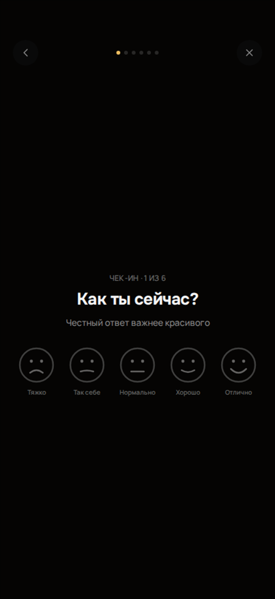

### Целевая метрика

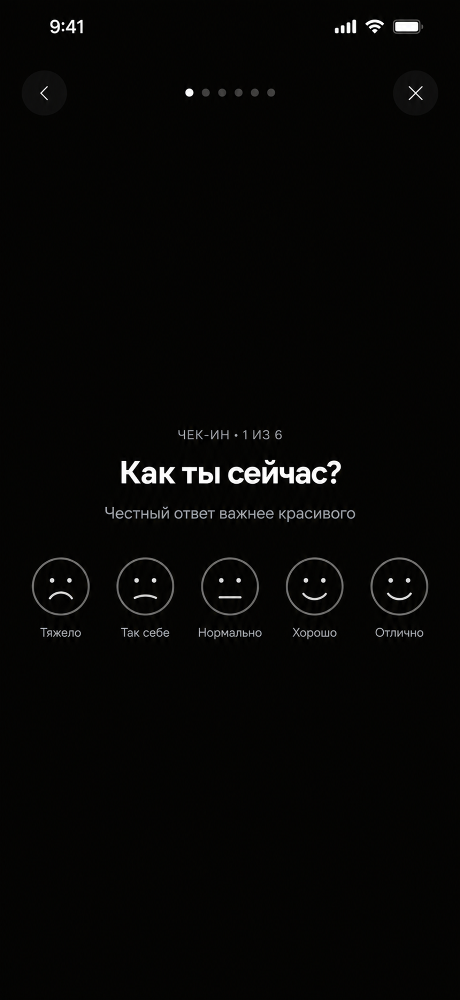

### Текущий журнал

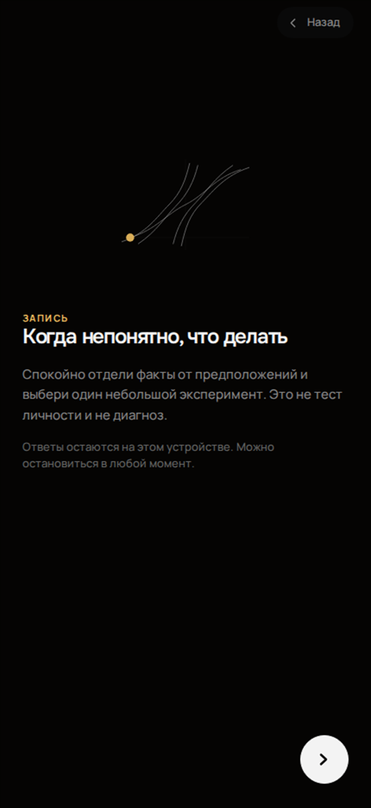

### Целевой редактор с клавиатурой

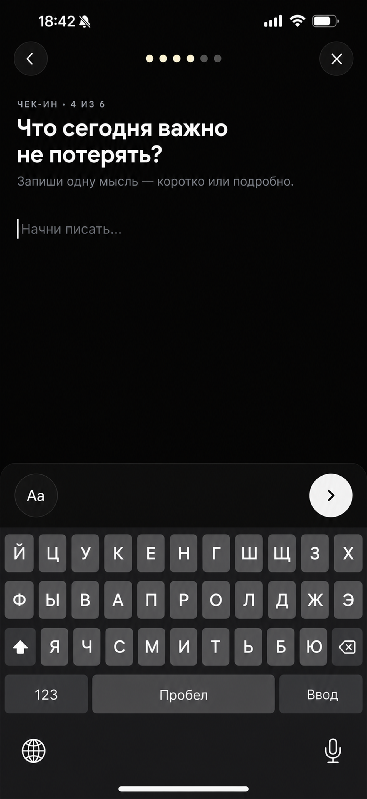

### Целевое завершение

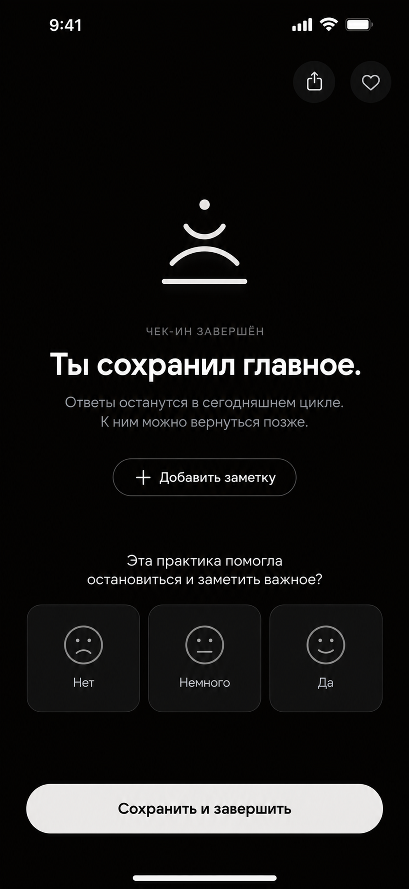

## Practices

### До

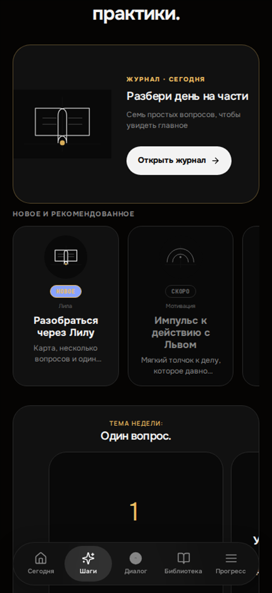

### Целевой каталог

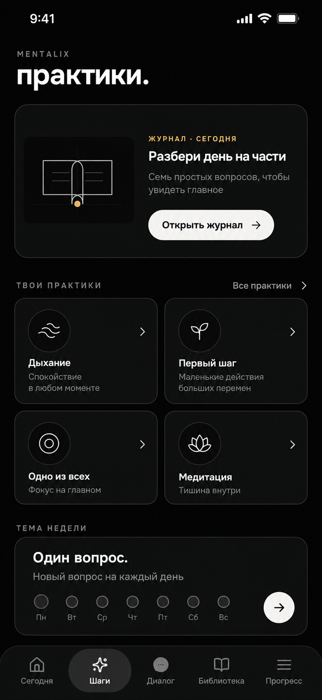

### Текущий fullscreen практики

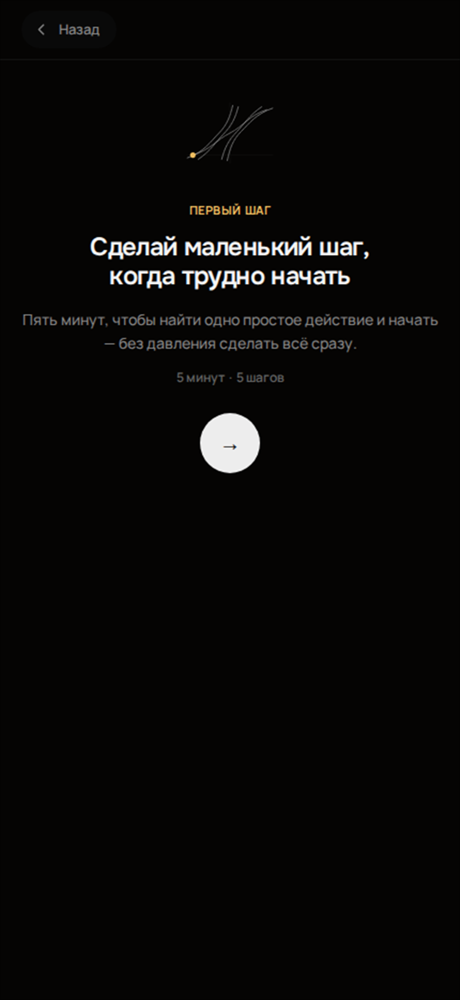

### Целевая библиотека

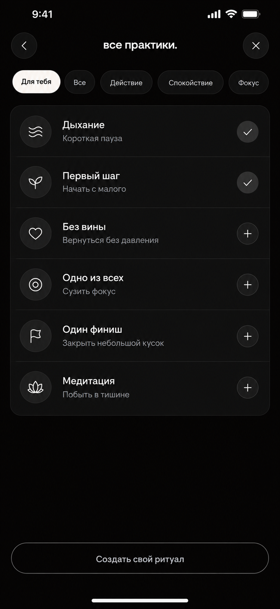

### Целевое дыхание

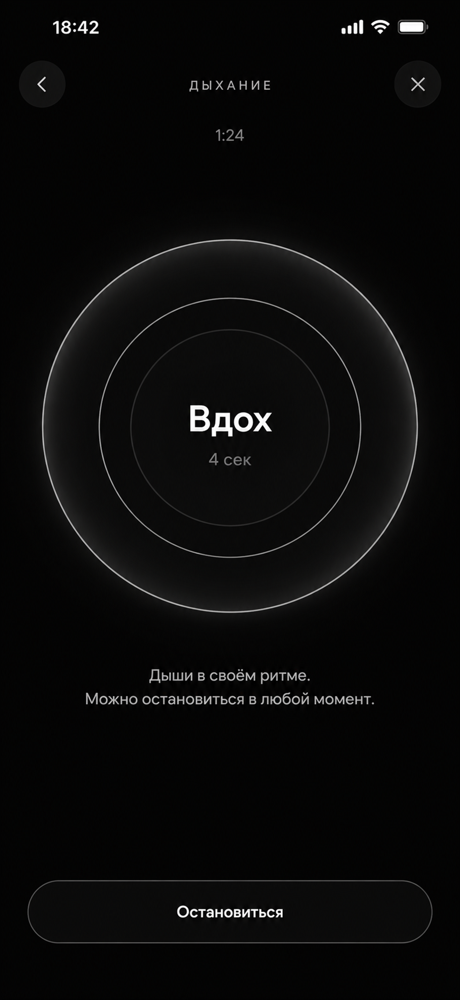

### Целевая тема недели

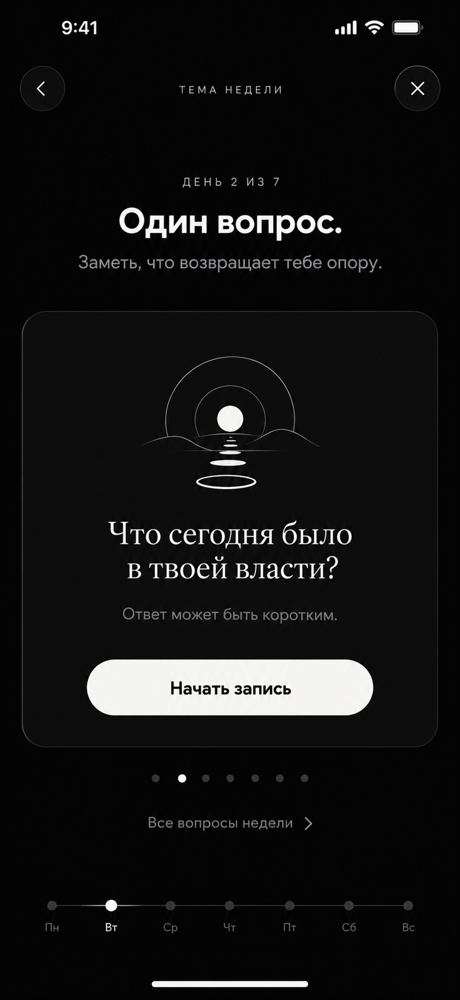

## Обязательные документы

- [Маршруты и состояния](./ROUTE_AND_STATE_CONTRACT.md)
- [Точный промпт агенту](./IMPLEMENTATION_PROMPT.md)

Агенту: выполнить задачу строго по PNG, `ROUTE_AND_STATE_CONTRACT.md` и `IMPLEMENTATION_PROMPT.md`. Все PNG `01–11` — физические полноэкранные референсы iPhone 16 Pro Max `1320×2868`. Текущий код и данные определяют реальные функции; PNG определяют визуальную композицию.

Ключевая граница: в работе только два сценария — Daily Check-In и Practices. Production/merge запрещены до отдельного разрешения и ручного Telegram/iPhone PASS владельца.
