# Глава III «Испытания» — иллюстрации курса «Путь героя»

Задача: подключить 8 иллюстраций (шаги `comparison`, `mirror`, `loneliness`, `relationships`; файлы `<id>-enter.webp` и `<id>-done.webp`). Глава I подключена тем же образцом в PR #1034 (слит в main как `a22ba310`), главы II и IV, финал и обложка курса не менялись.

## Что сделано

- 8 WebP в `src/assets/hero-journey/` — как получены, без пережатия и кропа: enter 1200×750 (1.6:1), done 1170×900 (1.3:1), 118–148 КБ каждый.
- Статические импорты и поля `image: { enter, done }` в `src/data/heroJourney.js` для четырёх шагов главы III.
- `image.anchor: 'top'` + класс `.mx-hj-hero-image--anchor-top` (`object-position: center top`) для входа шага `relationships`: при области 180 px центрирование срезало верх арки.
- Общая инфраструктура главы I не дублируется — берётся из `a22ba310`: маска `linear-gradient(to bottom, #000 0 65%, transparent 100%)`, области enter 390 × 180–260 и done 390 × 300, `object-fit: cover`, `width`/`height`, `decoding="async"`, preload следующего шага, `onError` → заглушка (глиф на входе, галочка на завершении).

Расхождений по id и именам файлов при аудите не нашлось: id в коде — `comparison` (9), `mirror` (10), `loneliness` (11), `relationships` (12).

## Проверки

| Команда (в `docker compose -f docker-compose.base44.yml exec -T web`) | Результат |
| --- | --- |
| `npm run check:core` (test:unit + lint + build + docs:check) | PASS |
| `npx playwright test --config=playwright.ux.config.mjs hero-journey-reliability.spec.mjs` | 5/5 PASS |
| прогон по 8 экранам (Chromium, 390×844 и 360×640) | картинки загружены, заглушка не показывается, ошибок в консоли нет |

Перед Playwright в свежем контейнере нужен `npx playwright install --with-deps chromium` — это записано в `AGENTS.md`.

## Измерения на живых экранах

Все восемь экранов: `naturalWidth/Height` = 1200×750 (enter) и 1170×900 (done), `img.complete = true`, `object-fit: cover`, атрибуты `width`/`height`/`decoding="async"`, маска `0 → 65%` непрозрачно, `100%` прозрачно, заглушка не рендерится.

| Экран | 390×844 | 360×640 | `object-position` |
| --- | --- | --- | --- |
| comparison enter / done | 390×260 / 390×300 | 360×180 / 360×277 | 50% 50% / 50% 50% |
| mirror enter / done | 390×260 / 390×300 | 360×180 / 360×277 | 50% 50% / 50% 50% |
| loneliness enter / done | 390×260 / 390×300 | 360×180 / 360×277 | 50% 50% / 50% 50% |
| relationships enter / done | 390×260 / 390×300 | 360×180 / 360×277 | **50% 0%** / 50% 50% |

Кадрирование (cover): на 390×844 область входа выше исходного масштаба картинки, поэтому по вертикали видно весь кадр, по горизонтали срезается ~6% (по 13 px с каждой стороны, по центру). На 360×640 область упирается в минимум 180 px: видно 80% высоты кадра — по центру (шаги comparison, mirror, loneliness) и от верха (relationships, чтобы арка осталась в кадре). Блок `done` совпадает по пропорции с картинкой 1.3:1 — кадр не срезается.

Бюджет: точка входа приложения (6 файлов из `dist/index.html`) — 263.3 КБ gzip, и это база: правки лежат в ленивом чанке экрана (`Library-*.js` 27.3 КБ gzip + `Library-*.css` 5.4 КБ gzip), сама правка добавляет ≈0.3 КБ gzip. Картинки в JS не инлайнятся, на шаг 251–297 КБ (лимит ≈ 1 МБ).

## Скриншоты

390×844 (iPhone):

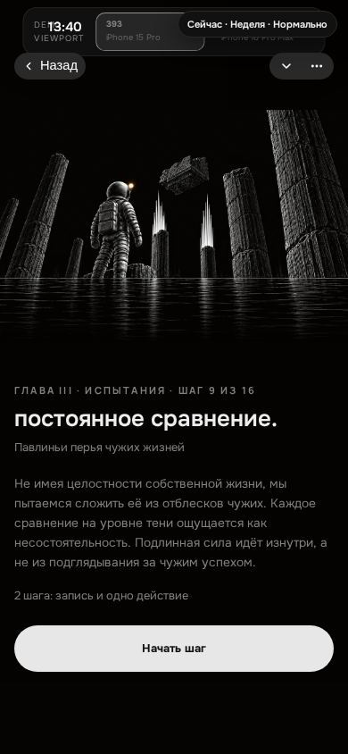
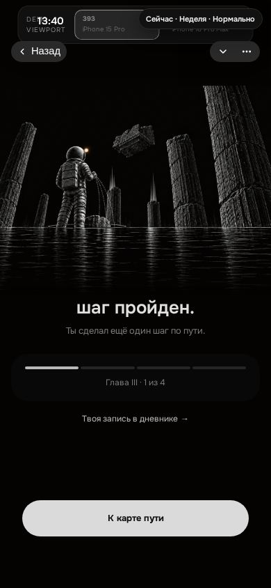
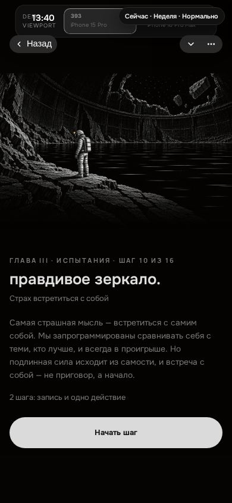
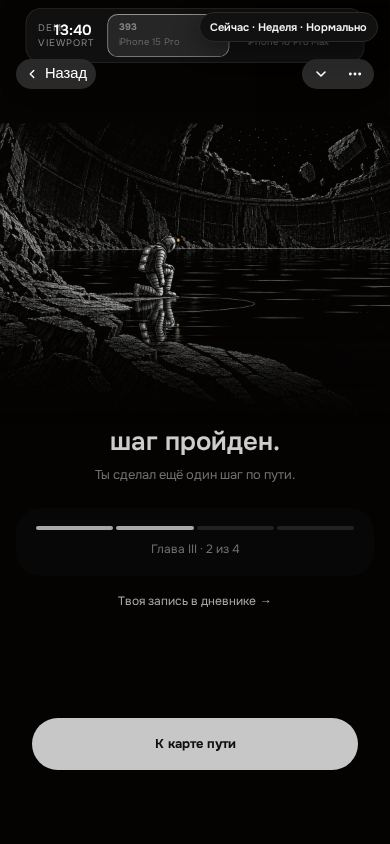
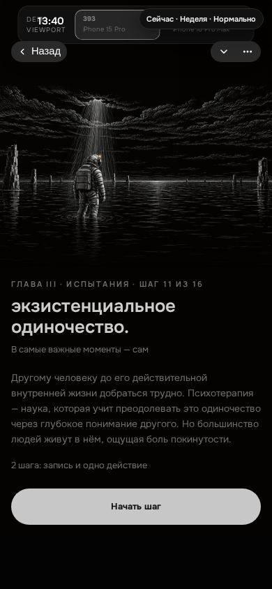
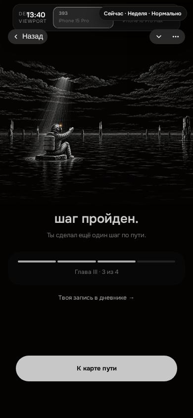
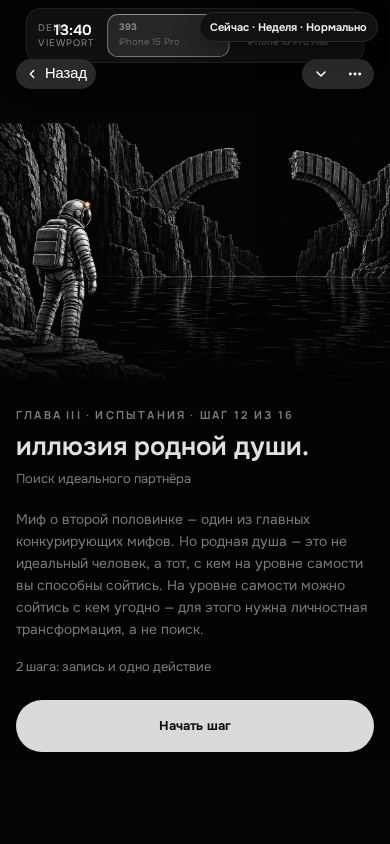
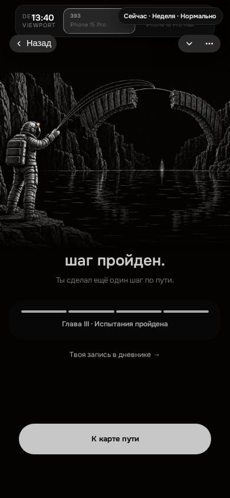

360×640 (малый Android):

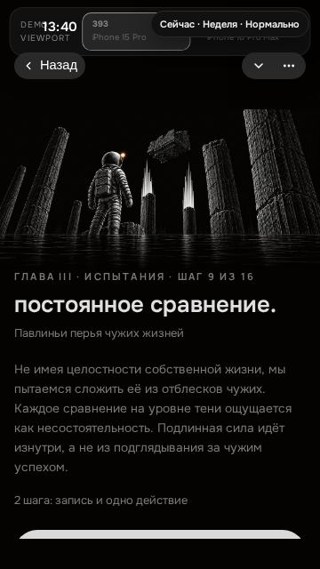
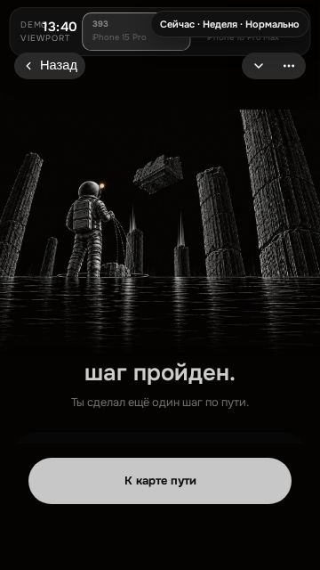
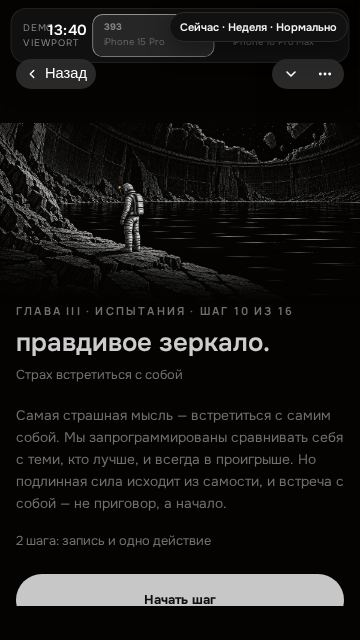
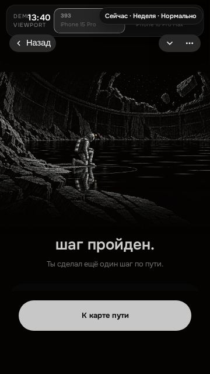
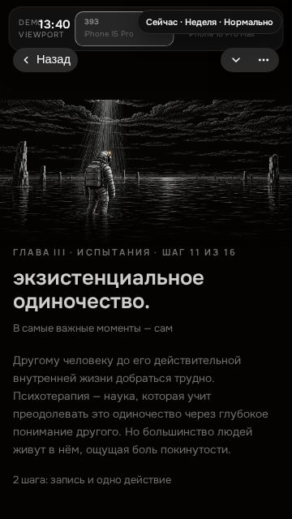
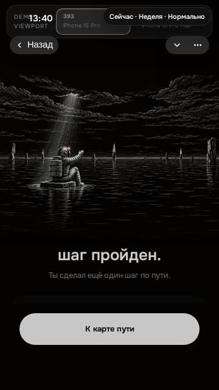
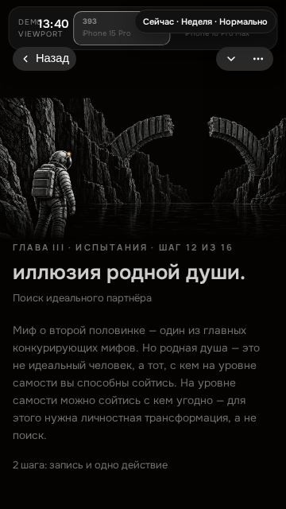
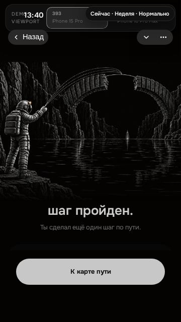

## NOT RUN

- Превью-таб был закрыт, поэтому скриншоты сняты Playwright'ом внутри web-контейнера, а не через превью; собственный визуальный осмотр экранов и ручной iPhone/Telegram gate — за владельцем.
