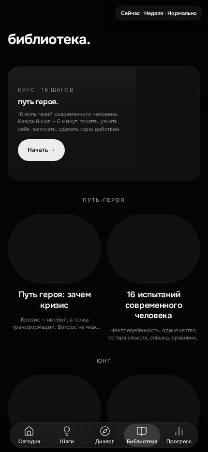
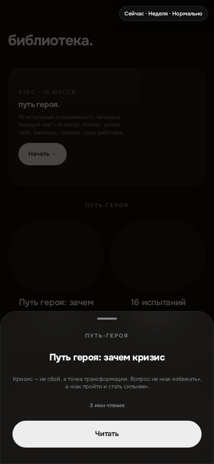
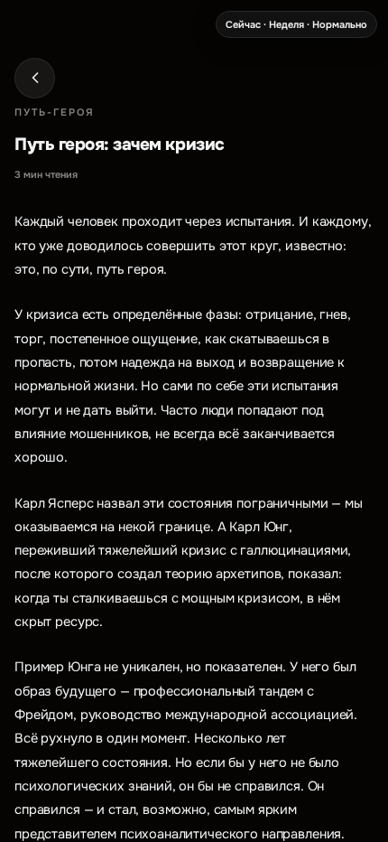
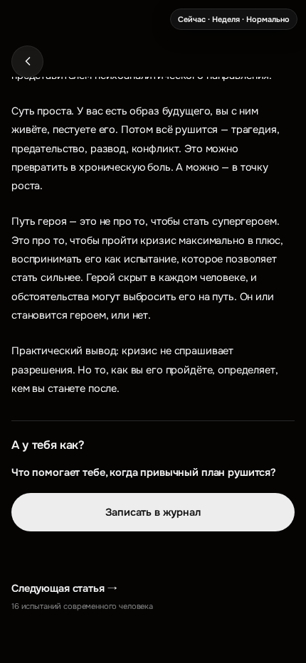

# Библиотека в стиле Stoic — отчёт

## Шаг 0 и сверка main

После `git fetch origin`:

| Проверка | Результат |
| --- | --- |
| Ветка | `stoic-library-v2` |
| HEAD до работы | `c82fad014a8aeef19bbb1e4110b494eaa26042c2` |
| `origin/main` | `c82fad014a8aeef19bbb1e4110b494eaa26042c2` |
| `git merge-base HEAD origin/main` | `c82fad014a8aeef19bbb1e4110b494eaa26042c2` |

Проверка пройдена. История не переписывалась: reset, rebase, force-push и переключений ветки не было. На старте рабочее дерево чистое, HEAD равен main, поэтому прочитанные исходники точно отражали main.

**Уже было:** заголовок «библиотека.», 16-шаговый курс и его прогресс, восемь статических статей с тегами, Onest / шкала размеров, общий Screen, стек «Назад», хук свайпа шторки, существующий журнал с настройкой. Это переиспользовано, а не создано заново.

**Не хватало:** общей с журналом карточки курса, тематических плиток на главной, пустых слотов, шторки предпросмотра, читалки без обложки, вопроса и перехода в журнал с возвратом, следующей статьи, скрытия программ/направленных записей, нормализации старых адресов, одного источника данных и целевого теста.

## Изменения

- `StepsJournalBanner` выделен из существующего баннера журнала «Шагов». Прежний журнал использует ту же оболочку без изменения текста и поведения; курсовой вариант — текст слева и пустая область справа, вся карточка нажимается, CTA «Начать →» / «Продолжить →» и прежний счётчик прогресса.
- На главной разделы «ПУТЬ-ГЕРОЯ» (2 статьи), «ЮНГ» (2), «ЕЩЁ ПОЧИТАТЬ» (4). Две колонки, пустые слоты-капсулы, центрированные названия и двухстрочные описания. В исходных данных и логике нет учёта прочтения, поэтому «ПРОЧИТАНО» не добавлено.
- Программы сохранены в `LibraryPrograms.jsx`, закрыты `LIBRARY_PROGRAMS_ENABLED = false`. Направленные записи больше не монтируются из Библиотеки; их код, данные и API сохранены.
- Старые query-входы `tab`, `sub`, `screen`, `action` и пути `/library/articles`, `/library/programs`, `/library/guided-journals`, `/journals/...` нормализуются в `/?tab=library`, сохраняя `demo=1` и прочие параметры. Отдельного роутера в приложении нет.
- Тап → шторка через Screen: ручка, затемнение, стек «Назад», Escape, общий свайп вниз, единственная белая «Читать». Пока она открыта, каталог inert; клавиатурный фокус остаётся в шторке и возвращается к плитке.
- Читалка: тема → название → минуты → исходные абзацы. Обложка удалена, ширина ограничена 60ch, межстрочный интервал 1.8, интервалы между абзацами — токены.
- Восемь коротких вопросов добавлены рядом с данными статьи. «Записать в журнал» открывает существующий DailyJournalFlow; новый журнал сразу показывает настройку, вопрос статьи используется для новой записи без перезаписи прежнего черновика/сохранённой записи. Выход возвращает к статье и её позиции. Следующая статья следует тому же разделу, потом следующему; конец каталога замыкается на первую.
- Каталог остаётся смонтированным под читалкой и шторкой; его нижний отступ сохраняется при скрытии навигации, чтобы не терялась позиция в конце списка. Автотест поймал эту проблему, исправление проверено повторно.
- Новые кнопки, ссылки и плитки — не меньше 44×44; рабочие высоты через токены 45/54. Шрифт только Onest, размеры через `--mx-type-scale`, поверхности/радиусы/отступы — существующие токены. Раздел «Библиотека» добавлен в `DESIGN_SYSTEM.md`.

**Не менялись:** карта и шаги курса, тексты/описания статей, backend, данные пользователей, основные вкладки, вход и точка загрузки `src/main.jsx` / `src/tgShell.js`.

## Где хранились направленные записи

По фронтенду `GuidedJournals.jsx`, `api.js`, `journalDraftV3.js`:

- Шаблоны, личные шаблоны и завершённые сессии: сервер `mentalix-bot`, существующие пути `/api/journal/templates`, `/api/journal/templates/sessions/complete`, `/api/journal/templates/sessions/mine`. Завершённая запись отправлялась на сервер, затем локальный черновик очищался.
- Незавершённые ответы, снимок вопросов, версия шаблона и ключ попытки: локальный `localStorage`, ключ `mx-journal-draft-v3:user:<userId>`.
- В демо сервер заменён существующим локальным demo-state, без production-записей.

Ничего не удалено, сервер не изменялся. Физическая схема/таблицы приватного backend не проверялись — отчёт описывает подтверждённый frontend-контракт.

## Источник статей

Выбран **статический `src/data/articles.js` (`ARTICLES`)**. В main действующая v2 уже показывала именно эти восемь полных материалов, тогда как параллельный API-каталог загружался для старого представления (в демо `/articles` даже возвращает пустой массив). Для этой задачи надёжнее сохранить опубликованные полные тексты и хранить вопросы рядом с ними.

Главная, шторка и читалка используют один `libraryArticles`; совместимый `libraryDataCache.js` возвращает тот же массив для старых потребителей. API не выбирает второй набор и устаревшие sessionStorage-снимки не подменяют контент. **Запасной вариант при недоступном API — тот же встроенный каталог:** статьи сразу доступны без сети, ожидания и падения, без смешивания двух версий. API-метод сохранён для совместимости, но продуктовая Библиотека его не вызывает. Публикация новых статей по-прежнему через коммит/релиз.

## Статьи, похожие на лекцию курса

По совпадению структуры и характерных формулировок с `heroJourney.js` выделяются шесть материалов:

| Статья | Совпадение |
| --- | --- |
| «Путь героя: зачем кризис» | Кризис, распад прежнего образа будущего, трансформация и путь героя — структура стадий курса. |
| «Тень и Персона: что прячем от себя» | Персона, цифровая идентичность, тень; «чем сильнее … соответствовать ожиданиям, тем больше растёт тень», «сгорел сарай, гори и хата». |
| «Самость: точка опоры внутри» | Самость под слоями личности, индивидуация, смерть эго / возрождение, рост «из единого центра». |
| «16 испытаний современного человека» | Тот же набор 16 испытаний, «будущее стало мгновенным», «слишком много дверей», «товарищ с хлыстом», отступление формирует долг. Самое прямое совпадение. |
| «Возрастные кризисы: когда черновик кончается» | Шаг «Возрастные кризисы»: израсходованный заряд, черновик/середина тетради и болезненный следующий этап. |
| «ИИ и самость: почему машина не заменит путь» | Шаг «Разрушение опор»: профессиональная идентификация, духовно-интеллектуальный труд, самость и внутренняя трансформация. |

У «Тревога приходит раньше, чем повод» и «Сон — это не пауза. Но и не уборка» таких совпадений не обнаружено; у них собственные научные источники. **YouTube URL/транскрипт лекции в данных курса и этих шести статьях отсутствует**: это список текстовых совпадений с курсом, не независимое доказательство конкретного видео или авторства. Тексты не переписаны.

## Проверки и evidence

Локально запускались только `check:core` и один UX-тест задачи, повторённый после исправлений; полный `ux:check` и WebKit не запускались/не устанавливались. Runtime — существующий Docker Compose, bind-mounted исходники и live dev server на 3000; healthcheck healthy, `/@vite/client` подтверждает живой исходник. Secrets для демо и статических статей не требуются.

`check:core` — PASS: unit 858 всего, 856 passed, 0 failed, 2 прежних skipped; ESLint, Vite build и docs:check прошли. `git diff --check` — без ошибок.

Целевой UX: `docker compose -f docker-compose.base44.yml exec -T web npx playwright test --config=pw-library-stoic.config.mjs` — 1 сценарий, Chromium, PASS. В нём проверены главная без скрытых разделов, открытие прежней карты курса и возврат, размеры плиток, затемнение, настоящий touch-свайп вниз, «Читать», конец статьи, настройка журнала и возврат к статье, следующая статья, возврат на главную, сохранение прокрутки у последней плитки, отсутствие горизонтального переполнения на 320/430/789. В общей CI-конфигурации обновлены проверки прежних входов; не отключены через skip.

Живая вкладка: тап по плитке → шторка → чтение → «Назад» прошёл; Onest подтверждён computed style, нет failed-запросов модулей/ошибочной накладки, root заполнен. Есть прежнее сообщение Telegram SDK о неподдерживаемом CloudStorage v6.0 в web-эмуляции, не ошибка новой читалки. Снимок самой вкладки инструмент не смог сделать (скрытая preview-панель); ниже реальные снимки Chromium из целевого теста, просмотрены после завершения анимаций.

### Скриншоты 430×932

- [Главная Библиотеки](home.png)
- [Шторка статьи](sheet.png)
- [Начало статьи](reader-start.png)
- [Конец статьи](reader-end.png)

**Ограничения:** ручной iPhone/Telegram gate (физика жестов, safe areas и клавиатура), полный CI и production deployment не подтверждены. Снимки имеют существующую демо-панель часов; она не добавлена этой задачей.

## PR

**Title:** Обновить Библиотеку в стиле Stoic

**Description:** Объединить курс и тематические статьи на главной Библиотеки; переиспользовать баннер журнала «Шагов», оставить пустые слоты для будущих иллюстраций, добавить шторку и читалку с вопросом, переходом в журнал и следующей статьёй. Скрыть программы флагом и убрать направленные записи из интерфейса без удаления данных/серверных изменений. Использовать единый встроенный ARTICLES независимо от API. Экраны курса и тексты статей не менять. Проверить check:core и один Chromium UX-сценарий; приложить четыре снимка 430×932. Полный UX/WebKit — CI, iPhone/Telegram — ручной gate.

Изменения записывались в файлы сразу; отдельные commit/push после каждого файла недоступны в этом рабочем процессе Base44 — платформа сохраняет и отправляет ветку автоматически в конце хода. Агент не выполнял ручной commit/push и не переписывал историю.
